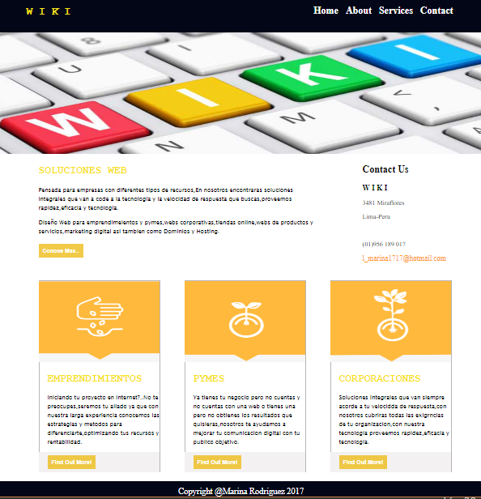

# MI PAGINA(WIKI)

* **Track:** _Common Core_
* **Curso:** _Crea tu propia red social_
* **Unidad:** _La web desde un móvil_

***
Creamos una pagina donde se ofrece soluciones Web,como webs corporativas,tiendas online,webs de productos y servicios,marketing digital asi tambien como Dominios y Hosting,utilizando los *Grid* para tener una pagina *responsive* tanto para mobile y desktop.

## Desarrollo:
* Para que nuestra pagina sea mobile se utilizo los grid de 12 columnas.

* En nuestro diseño de mobile se puede desplegar el menu de opciones.

* En el diseño de desktop utilizamos un grid de 2 y 3 columnas,asi mismo utilizamos *col-xs-offset-1* para tener una margen derecho.

